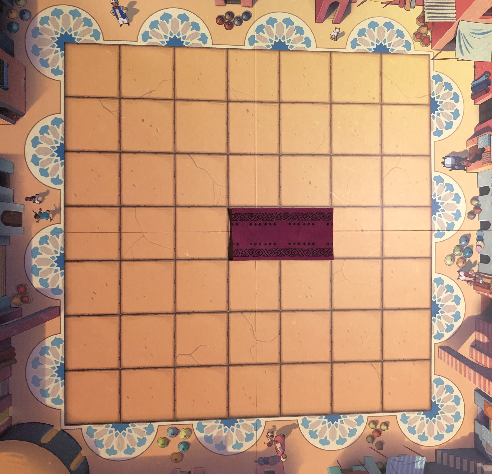
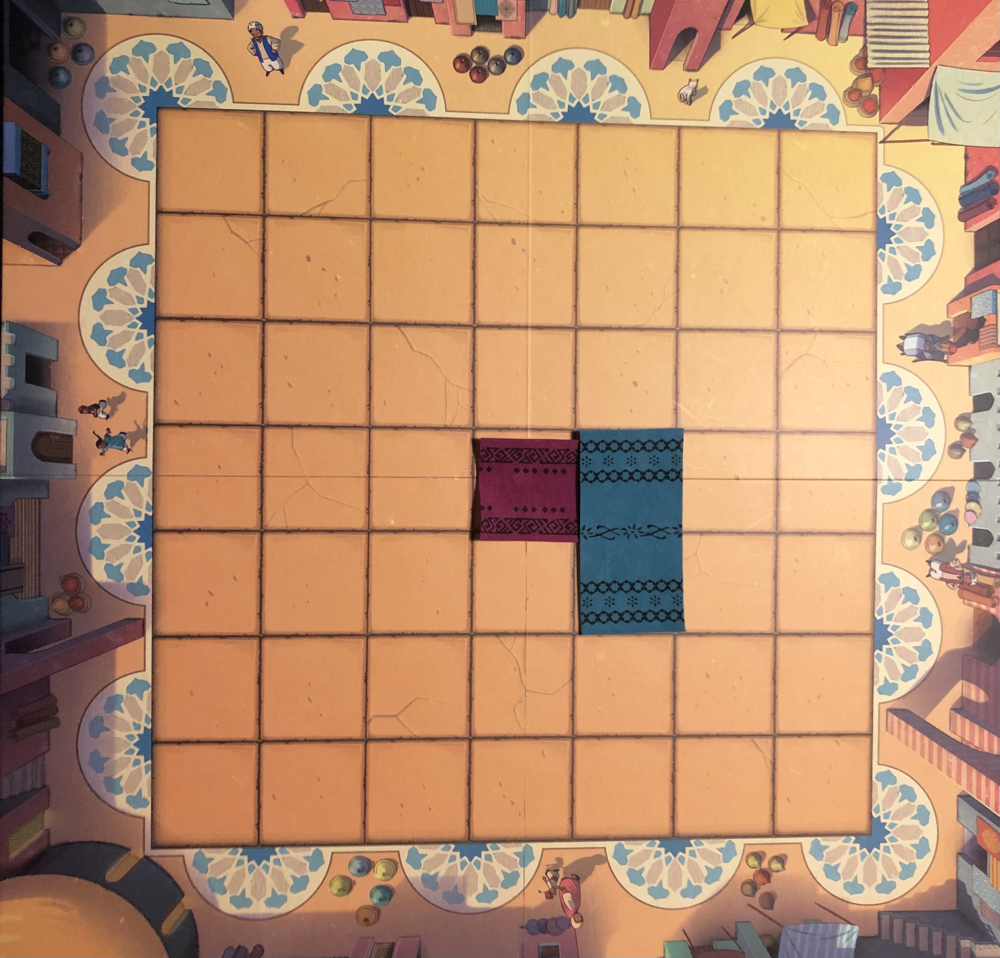
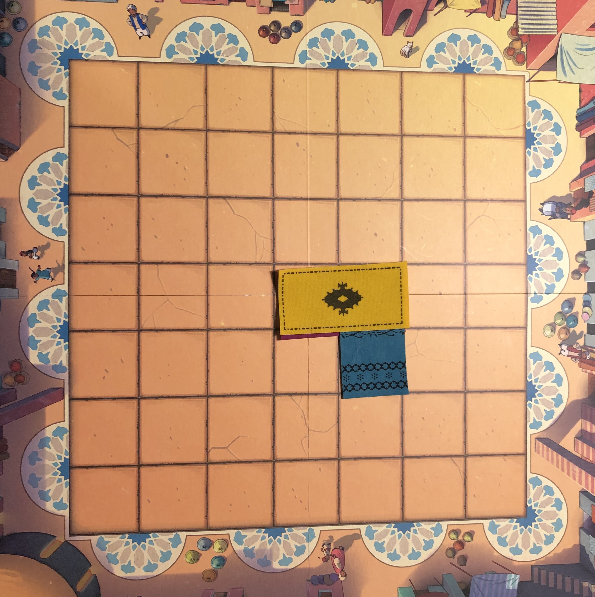

# Boardgame_Marrakech

This board game use JavaFX to build a user interface.

## Marrakech
In the game of Marrakech, two to four merchants in a crowded Marrakech souk compete to impress the market owner, Assam, in the hopes of being declared the best merchant in Marrakech. Players may direct how Assam wanders through the market to entice him into viewing their rugs, but be careful! If you put Assam on course to land on an opponent's rug, you will have to pay up!

### The Board and Players

Marrakech is played on a 7x7 board, with a minimum of 2 and a maximum of 4 players.

Each player starts the game with 15 rugs, which they will place on the board over the course of the game. Each rug is 2 squares long and one square wide (i.e they cover two squares on the board in a straight line).
Each player also has 30 dirhams (the currency in use in this game, and also in Morocco -- don't try and use the money from this game on a real-life trip to Morocco, though). The market owner, Assam, is also represented by a piece on the board, which moves as described below.

### Turns and Phases

Each player's turn consists of three phases:
First is the rotation phase, where a player may optionally rotate Assam.
Then, the player enters the movement phase, where a die is rolled and Assam moves, and the current player may be required to make payment to another player.
These two phases are described in the section [Assam and Payments Between Players](#assam-and-payments-between-players) below.
Last is the placement phase, where the current player must place a rug on the board.
The rules for placing the rug are describe in section [Rug Placement](#rug-placement) below.

The game is over when any player reaches the rotation phase of their turn, but does not have any rugs left to place. To be clear, when the first player places their last rug, the game will continue to allow any remaining players to place their final rugs. It is only over when a player enters the rotation phase and does not have any remaining rugs.

Once the game is over, it is scored. A player's final score is the number of dirhams they have plus the number of squares visible on the board that are of their colour. The player with the highest score wins. If two (or more) players have the same final score, then the player with the largest number of dirhams wins. If two (or more) of the tied players have the same number of dirhams, then the game is a draw.

### Assam and Payments Between Players

Assam is a key piece in the game of Marrakech, as he defines where players may place their rugs, as well as when players must pay other players.

Assam starts the game in the centre of the board (i.e at position (3,3)), and may be facing in any direction (since the board is a square).

At the beginning of a player's turn, they choose to rotate Assam either 90 degrees to the right or left, or not at all (i.e., leave him facing the same direction).

Then, a special die is rolled to determine how far Assam moves on this turn.
The die is 6-sided, but the sides are numbered 1-4, with the numbers not equally common.
It has:
- One face which shows a one
- Two faces which show a two
- Two faces which show a three
- One face which shows a four

This means that the die is twice as likely to show a 2 or 3 as it is to show a 1 or 4.

After the die has been rolled, Assam is moved in the direction he is currently facing with the number of spaces he moves matching the number shown on the die. If he goes off the board at any time, he follows a pre-defined mosaic track on the edge of the board in order to be placed back on it and continue his movement. These tracks can be seen in the following image of the board:

Note that following one of these tracks does not count as one of the steps in the movement -- Assam must traverse a number of squares equal to the number shown on the die regardless of whether he left the board at any time during his movement. An example taken from the game rules can be seen here:

Note also that this board image is the canonical one with respect to the mosaic tracks -- that is to say that the three-quarter circles on some of the corners of the board should be in the top-right and bottom left; **not** the top-left and bottom-right. This is important for the unit-tested tasks, which assume this configuration.

If, after his movement ends, Assam lands on an empty square or a rug owned by the player whose turn it is, no payment is made, and the player's turn moves on to the placement phase (described below in the "Turns and Phases" section). If, however, Assam lands on a rug owned by another player then the player who moved him will have to pay the other player. This payment is equal to the size of the connected region of squares that are covered by rugs of the same colour, starting from the square that Assam landed on. Connected here means adjacent in one of the cardinal directions, i.e., sharing an edge; squares that are only diagonally adjacent (sharing only a corner) do not count as connected. The square which Assam landed on does count towards the size of the connected region and thus the payment. If a player is unable to pay the full amount, then they must pay as much as they are able, and then they are out of the game. A player who is out of the game cannot win, nor can they take any further turns. If Assam lands on one of their rugs later in the game, it is as though Assam landed on an empty square, and no payment is required.

Please see the following images for some example situations and their associated payments required. In each of these examples it is assumed that the player who moved Assam does not own the rug that he has landed on.

### Rug Placement

**NOTE**: the pictures in this section depict the board, rotated by 90 degrees clockwise. ***This is not the way the board is depicted in the game***. The board is instead depicted as it is in [this picture](assets/Board%20Image.png), in the section "[Assam and Payments Between Players](#assam-and-payments-between-players)".

After Assam has moved and any required payment is completed, the current player must place a rug on the board according to the following conditions:
- At least one of the squares of the rug must be adjacent to (share an edge with) the square that Assam occupies.
- The rug must not be placed under Assam.
- The rug may not cover both squares of another rug that is already on the board, if both squares of that rug are visible (not already covered).

To clarify the third condition, it is acceptable for a rug to cover up part of one or more rugs on the board, but not to be placed directly on top of another rug and cover both squares of it in one turn.
A rug can be placed exactly on top of a previously placed rug if at least one square of the previous rug is already covered by another rug already on the board.

For example, if the current state of the rugs is as in the top-left image, we can see some examples of valid and invalid placements (note that obviously all of these are technically illegal since Assam isn't on the board here, but this serves as an example of the rules surrounding overlapping).

To give a specific example of the third condition, if the board is currently set up like this:

And then the blue player plays like this:

It is legal for the yellow player to play like this, even though it results in covering up an entire purple rug, because it does not cover both squares of that rug in the same turn (one of them has already been covered separately by the blue rug).

